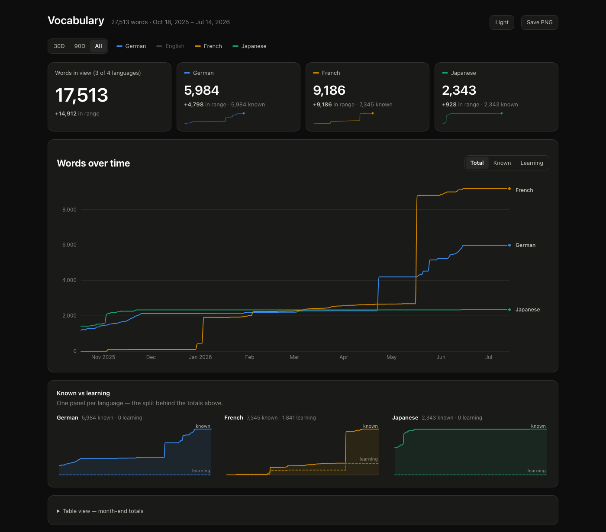
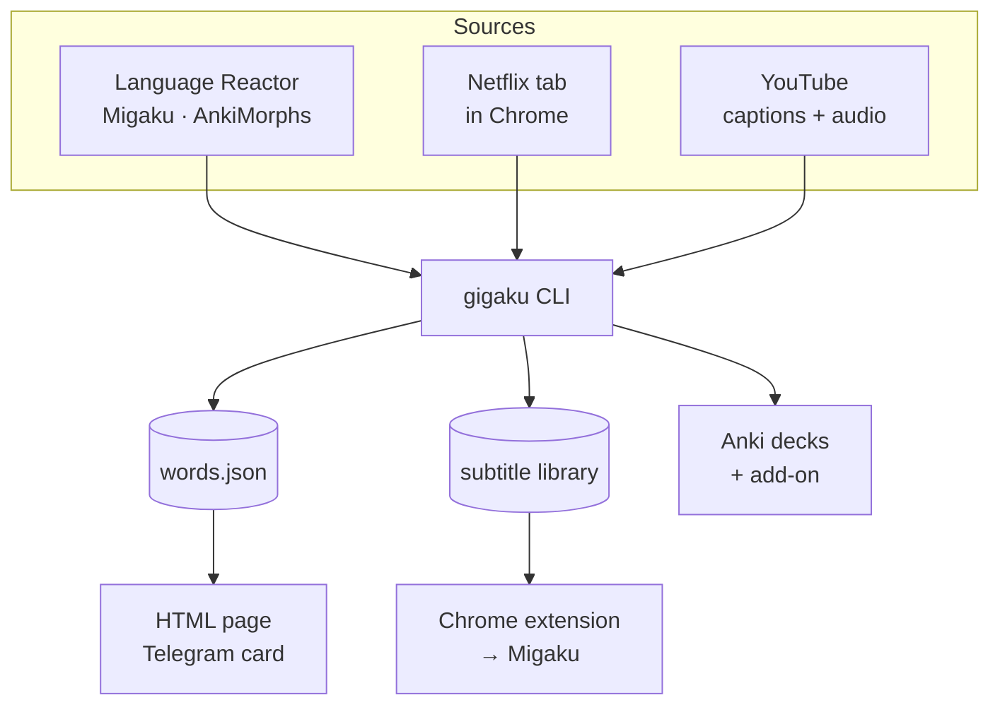

<h1 align="center">gigaku</h1>
<p align="center"><b>Netflix, YouTube and Anki wired into one German and Japanese study pipeline</b></p>
<p align="center">
  
  
  
</p>

<p align="center"></p>

gigaku is a language-learning toolkit for macOS: a Python CLI, a Chrome extension, an Anki
add-on and a few launchd agents. It tracks the words you know across Language Reactor, Migaku
and Anki, rips Netflix subtitles into Migaku without playing the video, and picks flashcard
sentences by how well they teach the word.

## What it does

- **Vocabulary history.** Imports known words from Language Reactor, Migaku and AnkiMorphs into one per-day cache, drawn as a self-contained HTML page.
- **Netflix subtitle ripping.** Exports a whole season through Language Reactor in a background tab, never playing the video, as aligned SRT pairs.
- **Proofread and glossed.** The ASR German is spell-checked and glossed into Russian line by line through the `claude` CLI, with ids echoed so nothing shifts.
- **Netflix catalogue.** Rips a browse gallery through Netflix's own client, joins IMDb's datasets and ranks the titles you have not watched.
- **Anki decks that teach.** Scores every i+1 card by how much its sentence reveals the unknown word; builds German decks from frequency lists or YouTube.
- **Mouse-wheel remote.** A signed launchd stub turns the wheel into Apple TV volume, the TV's own remote as fallback, and the buttons into Netflix keys.
- **Nightly backup and report.** Snapshots every word source into a git repo, publishes the page, and posts a weekly chart card to Telegram.

## Quick start

```bash
uv sync && uv run gigaku --help         # or: uv tool install --editable . --force
gigaku import && gigaku plots           # Language Reactor export in ~/Downloads first
gigaku subs                             # one Netflix tab open in Chrome
gigaku titles                           # a Netflix gallery, ranked by IMDb rating
anki/link.sh                            # symlink the add-on into Anki, then restart it
uv run python scripts/pair_appletv.py   # pair the Apple TV once, then: gigaku sound
```

Requirements: macOS, Python 3.14+, [uv](https://docs.astral.sh/uv/), and Chrome with
*View ▸ Developer ▸ Allow JavaScript from Apple Events* enabled. Per feature: Language
Reactor Pro, Migaku, Anki with AnkiConnect, the `claude` CLI on `PATH`, an Apple TV.

## How it works



Every source is read where it already lives: Language Reactor's export, Migaku's word list
straight out of Chrome's IndexedDB, AnkiMorphs' known morphs from the Anki collection. One
JSON cache holds the only per-day history; every page, report and backup derives from it.

Chrome is driven over AppleScript on a tab found by URL, so a rip runs in the background
while you keep working. Everything that needs a language model goes through one transport,
`lib/claude.py`; every Anki write goes through AnkiConnect.

<details><summary><b>Driving Chrome without stealing focus</b></summary>

- `subs` drives Language Reactor's own in-page controller and `titles` calls Netflix's own
  falcor client, so a Netflix build bump costs a probe (`gigaku titles --probe`), not a rewrite.
- Page visibility is spoofed in the page's main world, so Netflix keeps switching tracks and
  generating ASR in a hidden tab; the video is never played, not even for ASR.
- A main-world hop (`lib/platform/chrome.py`) reaches the page globals an isolated script
  cannot; JavaScript dialogs are captured rather than shown, because a dialog freezes every
  further call on that tab.
- Waits are adaptive: a stall reloads and retries, a rate limit is waited out, an episode that
  keeps failing is skipped, and a re-run resumes at the first episode without a `Primary.srt`.
- The exported text is checked by script, not by label: a track that silently reverted to
  Japanese is refused before anything is written.

</details>

<details><summary><b>One LLM transport</b></summary>

- `lib/claude.py` wraps `claude -p`: no API key, no SDK. Proofreading, glossing, clarity
  scoring and the deck builders share it, each with its own rubric.
- Every contract is plain lines matched on an echoed id, so a short reply becomes a named gap
  that is re-asked, and a cue can never receive another cue's text.
- Requests are hundreds of items with unasked neighbours as context; answers are written to
  disk after every request, so a rate limit costs one request, not a run.
- `spell` keeps a per-series ledger of character names, grouped once per show, so a name
  misheard five ways is settled the same way in every episode.
- `clarity` rates a word's cards against each other in one block, whole or not at all, and the
  add-on studies the clearest card per word.

</details>

<details><summary><b>The wheel daemon, TCC and the LAN</b></summary>

macOS binds the Accessibility grant to a signature and a path, so `launchd/GigakuSound.m` is
a 40-line stub that forks the Python daemon and stays its responsible process across
interpreter upgrades. Build, sign, grant, load (put your clone's path into the plist first):

```bash
mkdir -p launchd/GigakuSound.app/Contents/MacOS
clang -framework Foundation -x objective-c \
      -o launchd/GigakuSound.app/Contents/MacOS/GigakuSound launchd/GigakuSound.m
codesign --force --deep --sign - launchd/GigakuSound.app
# System Settings ▸ Privacy & Security ▸ Accessibility → add launchd/GigakuSound.app
cp launchd/com.gigaku.sound.plist ~/Library/LaunchAgents/
launchctl load ~/Library/LaunchAgents/com.gigaku.sound.plist
```

Rebuilding the stub drops the grant: re-sign, `tccutil reset Accessibility com.gigaku.sound`,
and re-add the app.

When the Apple TV cannot be reached, the same step goes to the Samsung TV's own remote — the
same speaker over HDMI-CEC. Devices are found by hardware MAC, never by a written-down IP;
`scripts/lan_bypass.README.md` covers an access point that isolates its clients.

</details>

## Commands

| Command | What it does |
|---|---|
| `gigaku import` | Language Reactor, Migaku, AnkiMorphs → word cache |
| `gigaku plots` / `gigaku publish` | the history as an HTML page; rsync it to a server |
| `gigaku report --send` / `gigaku backup` | the weekly Telegram card; the nightly git snapshot |
| `gigaku kanji` / `gigaku anki` / `gigaku words` | kanji by known words; an Anki query; word lists |
| `gigaku subs [N-M]` | rip the current Netflix season via Language Reactor |
| `gigaku spell` / `gigaku translate` | proofread the ASR German; gloss it into Russian |
| `gigaku srt TITLE` | Language Reactor Excel exports → SRT pairs |
| `gigaku titles [URL]` | rip a Netflix gallery and rank it by IMDb rating |
| `gigaku clarity` | rate i+1 cards by how obvious the unknown word is |
| `gigaku sound` | the mouse-wheel → Apple TV volume daemon |
| `gigaku info` / `gigaku clear-cache` | print every setting; delete the word cache |

Status goes to stderr, never stdout, so `kanji`, `anki`, `words` and `titles --tsv` pipe cleanly.

## Configuration

Every field of `Settings` in `lib/config.py` reads a `GIGAKU_<NAME>` environment variable and
is overridden by the matching flag; `gigaku info` prints them all. The cache lives in
`~/Library/Caches/gigaku/`.

Credentials are not settings: the Telegram env file, the Apple TV pairing (`.atv_storage`) and
the TV token (`.tv_remote_token`) stay outside `gigaku info`.

| Setting | Meaning |
|---|---|
| `EXPORTED_FILES_DIR` | where exports land (`~/Downloads`) |
| `RM_PROCESSED_FILES` | delete exports once imported (`True`) |
| `CHROME` | read Migaku's words out of Chrome's IndexedDB (`True`) |
| `SRT_TARGET_DIR` | the subtitle library (`chrome/gigaku/subs/`) |
| `SUBS_TRANSLATE` / `SUBS_SPELL` | gloss and proofread a rip via `claude` (`True`) |
| `PLOTS_HIDDEN_LANGS` | languages toggled off at first open (`en,fr`) |
| `PUBLISH_HOST` / `PUBLISH_DIR` | rsync target (`""` = local copy, `~/Sites/gigaku`) |
| `TELEGRAM_ENV_FILE` | bot token and chat id (`~/.config/gigaku/telegram.env`) |
| `BACKUP_DIR` / `BACKUP_REMOTE` | the backup repo and its remote (`~/vocab-backup`, `origin`) |
| `TITLES_HIDE_GENRES` | genres left off the titles page (`Crime,Documentary`) |
| `CLARITY_MODEL` | the model behind `claude -p` (`opus`) |

## Project layout

```
lib/cli.py                    the `gigaku` entry point; domains imported lazily
lib/config.py  pages.py       settings, device constants, shared page rendering
lib/claude.py  telegram.py    the two transports: `claude -p`, the Telegram bot
lib/vocab/                    import · plots · publish · report · backup · kanji
lib/subs/                     subtitle ripping, proofreading, glossing, xlsx → SRT
lib/netflix/                  gallery rip, IMDb join, watched sync, player remote
lib/anki/  lib/platform/      clarity scoring; AppleScript, Chrome driving, LAN
lib/appletv/  lib/samsung/    the two remotes; lib/volume.py chooses between them
scripts/  launchd/            the daemon, pairing, LAN bypass; agents, stub source
chrome/gigaku/                MV3 extension: subtitles into Migaku, audio, keys
anki/gigaku/                  the Anki add-on; anki/link.sh symlinks it in
freq/  freqdeck/              the German frequency list and the deck built from it
.claude/skills/sentence-mining/   YouTube playlist → cards, scripted end to end
tests/                        pytest, with real export fixtures in tests/data/
```

Per-folder docs: [chrome/gigaku](chrome/gigaku/README.md) · [freq](freq/README.md) ·
[freqdeck](freqdeck/README.md) · [lan_bypass](scripts/lan_bypass.README.md) ·
[sentence-mining](.claude/skills/sentence-mining/SKILL.md) · engineering notes in each
domain's `CLAUDE.md`, mapped from the root [CLAUDE.md](CLAUDE.md).

## Development

```bash
uv sync                # runtime + dev group (pytest, ruff)
uv run pytest          # pure logic + smoke tests that run each page's JS in Chrome
uv run ruff check .    # lint (E, F; line length 100)
```

Nothing touches a live Anki, Netflix, Apple TV or `claude`: the fixtures stub every one of them.

## License

[MIT](LICENSE).
